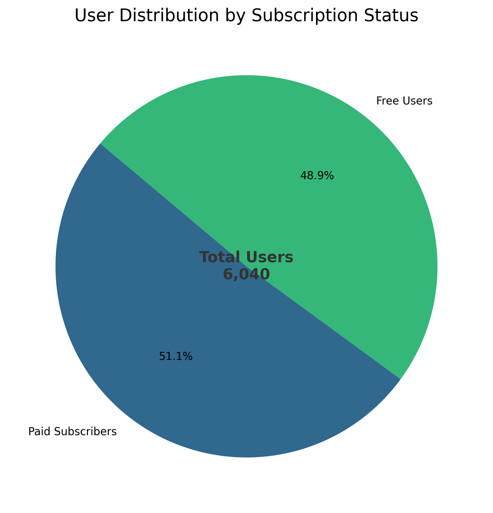
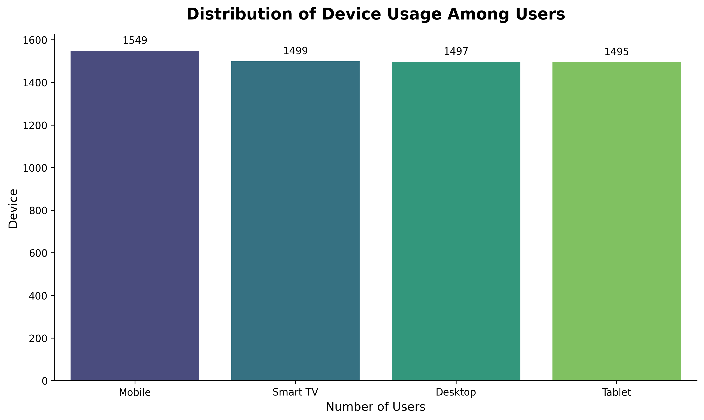
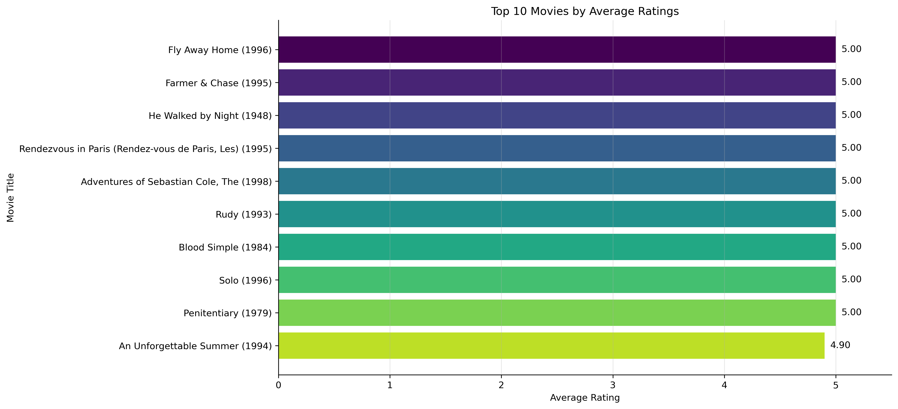
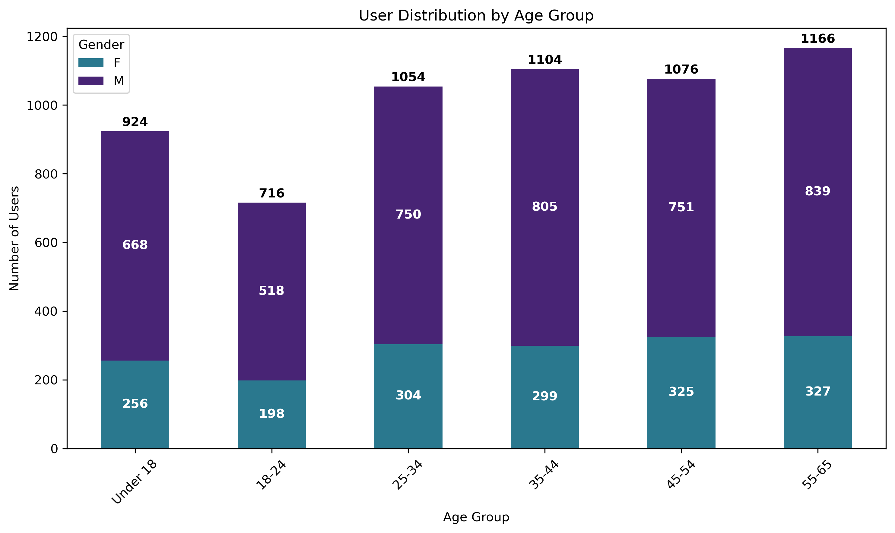
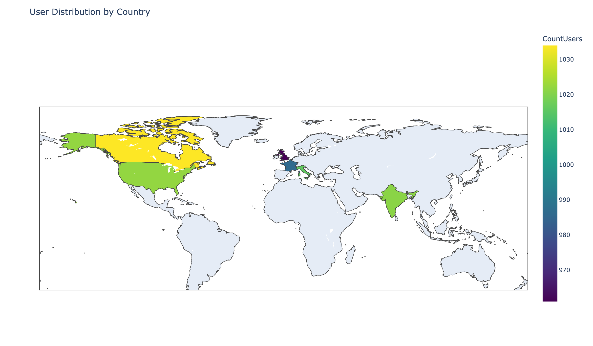

# Streamflix Analytics

This project supports Streamflix’s transition from an ad-supported model to a subscription-based business. We analyzed user, movie, and rating data to identify what content should be prioritized, how audience preferences vary by region and age, and which actions can improve conversion from free users to paid subscribers.

## Business Problem

Streamflix needed evidence-based direction for three core questions:

- which content drives subscriptions,
- how user preferences vary by region and age,
- which content can sustain long-term retention.

## Key Insights

Our analysis showed that:

- Drama and Comedy are the strongest genres, both in popularity and in ratings.
- These two genres should be the main focus for future content investment because they offer the highest potential for engagement and subscription conversion.
- The audience uses the platform across phones, smart TVs, computers, and tablets, so the user experience must be consistent across all devices.
- The largest user segment is in the 55–65 age range, while male users outnumber female users across most age groups.
- North America and Western Europe are the strongest current markets, while South America, Southeast Asia, and parts of Africa represent the biggest growth opportunities.
- The platform currently has a nearly even split between free and paid users, which creates a strong opportunity to convert free viewers into subscribers.

## Business Recommendations

Based on the findings, the recommended strategy is to:

1. Prioritize Drama and Comedy in future content investment.
2. Improve the experience across all devices to reduce drop-off and support retention.
3. Expand into growth regions with localized content and targeted regional marketing.
4. Run conversion campaigns that highlight premium Drama and Comedy titles for free users.

## What This Repository Contains

- data/ – cleaned and original datasets
- python_scripts/ – notebooks for data cleaning, validation, loading, and visualization
- sql_scripts/ – SQL scripts for creating and managing the database structure
- ERD_schema/ – database schema and relationship diagram
- Excel/ – source and cleaned spreadsheet files
- PowerBI/ – Power BI dashboard files

## How to Run the Project

1. Open the project in VS Code or Jupyter.
2. Launch the notebooks from python_scripts/.
3. Run the workflow in the following order if you want to reproduce the analysis:
   - clean the data_movies.ipynb
   - data_check.ipynb
   - load_data.ipynb
   - Visualisation Requests by Client.ipynb
4. If you use MySQL, make sure the database is running and the connection settings in the notebook match your environment.

## Visualizations in the README

Charts from the notebooks can be added to the README by exporting them as image files and linking them in Markdown. Direct embedding of .ipynb outputs into GitHub README is not supported, so the usual workflow is:

1. Run the chart in the notebook.
2. Export it as a PNG or SVG file.
3. Save the image in the images/ folder.
4. Add it to the README using Markdown, for example:

```md

```

Below are the key charts from our analysis (saved in `images/`):












## Project Status

- Data cleaning and validation are completed for the current datasets.
- The analytics workflow, SQL structure, and visualizations are documented in the repository.
- The project is ready for further business analysis and reporting.
